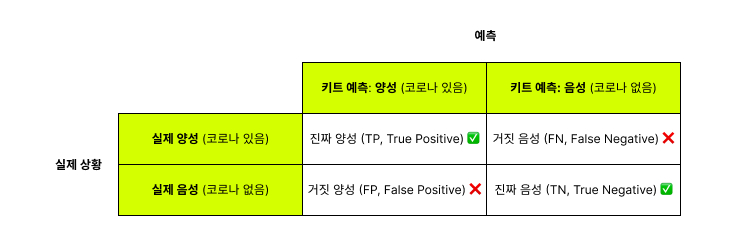
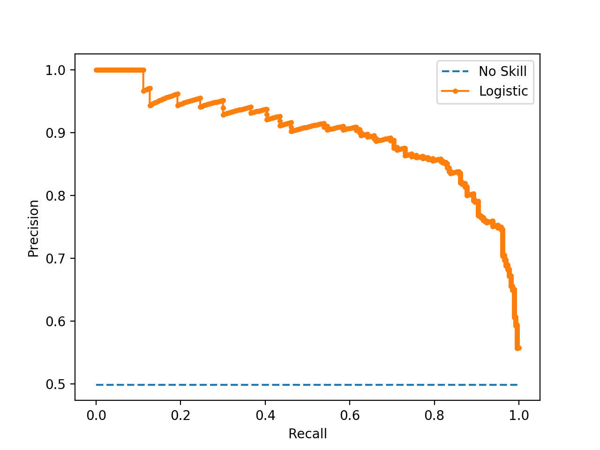
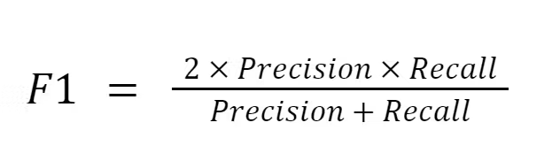
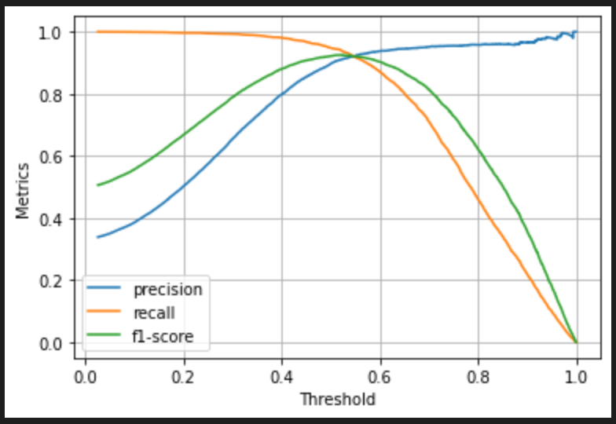
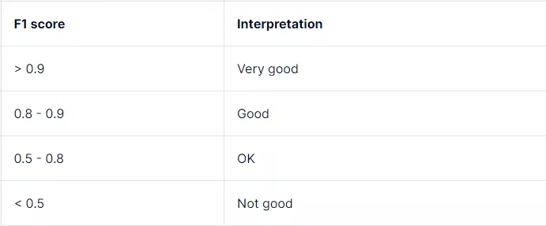

지난 7년간 극초기 스타트업, IT 서비스 대기업, 프리랜서, 창업을 거치면서 얻은 배움을 정리해보고자 한다.

그동안 배운 모든 것을 글로 적으려면 벽돌책 한 권으로도 부족할 테지만,  
분량을 고려해 내가 삶에서 가장 유용하게 적용 중인 몇 가지를 짧게 소개하려 한다.

첫 번째. 혼동 행렬 (Confusion Matrix)  
두 번째. 중학교 수준의 통계: 중앙값, 평균, 최빈값 (Median, Mean, Mode)  
마지막으로 세 번째. 휴리스틱 (Huristic)

첫 번째 ‘혼동 행렬’부터 말해보겠다.

## 1. 혼동 행렬이란?

머신러닝이나 데이터 모델링을 공부해 본 사람이라면 혼동 행렬(Confusion Matrix)을 들어보았을 것이다.  
혼동 행렬이란 머신러닝에서 이진 분류(Binary Classification)의 성능을 평가할 때 사용하는 표로, 모델이 예측한 결과가 실제 결과와 얼마나 일치하는지를 나타낸다.

예를 들어, 코로나 자가진단 키트를 사용하여 코로나 감염 여부를 진단한다고 가정해보자.  
그러면 다음과 같은 네 가지 경우가 생긴다.

- **TP (True Positive, 진짜 양성)** ✅  
  실제로 코로나에 걸렸고, 키트도 양성으로 맞게 진단한 경우  
  (→ 바람직한 예측)

- **FN (False Negative, 거짓 음성)** ❌  
  실제로 코로나에 걸렸는데, 키트가 음성으로 잘못 진단한 경우  
  (→ 병을 놓치게 됩니다.)

- **FP (False Positive, 거짓 양성)** ❌  
  실제로 코로나에 걸리지 않았는데, 키트가 양성으로 잘못 진단한 경우  
  (→ 불필요한 걱정이나 추가 검사로 이어질 수 있습니다.)

- **TN (True Negative, 진짜 음성)** ✅  
  실제로 코로나에 걸리지 않았고, 키트도 음성으로 맞게 진단한 경우  
  (→ 바람직한 예측)

이 네 가지 지표를 통해 모델의 예측 성능을 보다 깊이 있게 평가할 수 있다.  
혼동 행렬로부터 얻을 수 있는 주요 지표는 다음과 같다.

- 전체 예측 중 정확히 예측한 비율 (**정확도**, Accuracy)
- 양성 판정된 사례 중 실제로 양성인 사례의 비율 (**정밀도**, Precision)
- 실제 양성 사례 중 놓치지 않고 탐지한 비율 (**재현율**, Recall)

정밀도와 재현율은 서로 상충(trade-off)하는 관계에 있다.

- 정밀도가 높으면 재현율이 낮아진다. (보수적 예측, 신중한 결정)
- 재현율이 높으면 정밀도가 낮아진다. (적극적 예측, 많은 기회를 탐지)

## 2. Type 1 Error, Type 2 Error

혼동 행렬을 다룰 때 반드시 언급해야 할 것이 바로 Type 1 Error와 Type 2 Error이다.

- **Type 1 Error(제1종 오류)**:
  - 실제로는 음성(정상)인데 양성(이상)으로 잘못 판단하는 오류로, FP(False Positive)에 해당한다.
  - 즉, 불필요한 조치나 걱정을 일으킨다.
- **Type 2 Error(제2종 오류)**:
  - 실제로는 양성(이상)이지만 음성(정상)으로 잘못 판단하는 오류로, FN(False Negative)에 해당한다.
- 이 오류는 문제를 발견하지 못하고 놓쳐서 심각한 결과로 이어질 수 있다.

예를 들어 암 진단이나 코로나19 검사와 같은 중대한 질병의 진단에서는 제2종 오류(Type 2 Error)를 최소화하는 것이 가장 중요하다.  
재현율이 정밀도보다 더 중요하다는 이야기다. 실제 환자를 한 명이라도 놓치면 치명적인 결과가 발생할 수 있기 때문이다.

금융 거래의 사기 탐지 시스템도 이와 마찬가지로, 실제 사기를 놓치면 막대한 손해가 발생하기 때문에 다소의 오탐(FP)을 감수하고서라도 적극적으로 탐지하는 전략을 사용한다.

반면 이메일 스팸 탐지나 맞춤형 추천 시스템과 같은 서비스에서는 제1종 오류(Type 1 Error)를 최소화하여 신뢰를 유지하는 것이 중요하다. 정밀도가 재현율보다 더 중요하다.  
잘못된 추천이나 잘못된 스팸 분류는 서비스의 신뢰도를 급격히 떨어뜨리고 사용자의 불편을 초래한다.  
이때는 다소 기회를 놓치더라도 보수적으로 판단하여 신뢰도를 유지하는 것이 중요하다.

정밀도와 재현율을 trade-off 관계이므로 이 둘의 균형을 밸런스있게 유지하는 것이 매우 중요하다.  
정밀도와 재현율의 균형을 가장 잘 나타내는 지표가 바로 **F1 스코어(F1 Score)**이다.

Precision, Recall, F1 Score의 관계를 그래프로 나타내면 다음과 같은 양상을 보인다.

일반적으로 F1 스코어가 0.8 이상이면 정밀도와 재현율이 균형 잡힌 상태로 볼 수 있다.

지금까지 혼동 행렬, 정밀도, 재현율, F1-Score를 이야기했다.  
이야기를 결론짓자면,  
우리가 인생에서 마주치는 의사결정의 순간도 비슷하다.  
커리어 선택이나 결혼, 이사와 같은 큰 결정부터  
오늘 점심 메뉴나 옷 선택과 같은 작은 결정까지 삶은 늘 선택과 결정의 연속이다.

지금 당신이 마주한 선택을 다시 살펴보자.  
이번 선택이 한 번의 실패로 큰 손해를 볼 수 있는 결정이라면,  
FP(거짓 양성)를 최대한 줄이는 보수적인 결정을 내려야 한다.

반대로 실패의 비용이 크지 않다면 Threshold를 줄여 FP (거짓 양성)을 감수하더라도 적극적으로 기회를을 높이는 방향으로 접근하는 게 더 유리할 수 있다.

이렇게 혼동 행렬의 Type 1, Type 2 Error 개념을 이해하고 적용하면 당신의 인생에서도 더 현명하고 전략적인 의사결정을 내릴 수 있을 것이다.  
결국 이 원리를 활용해 지혜롭게 균형을 잡는 것이 바로 엔지니어로서 배운 중요한 삶의 지혜가 아닐까.
