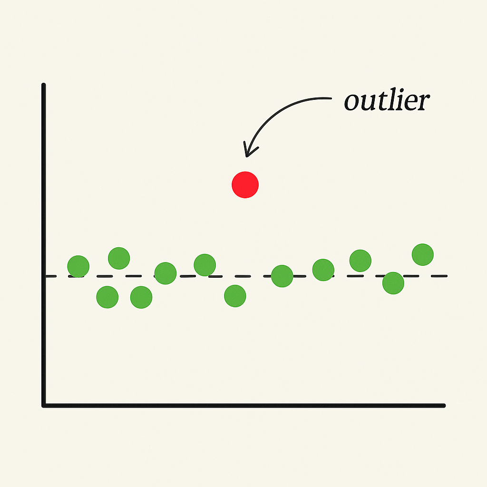
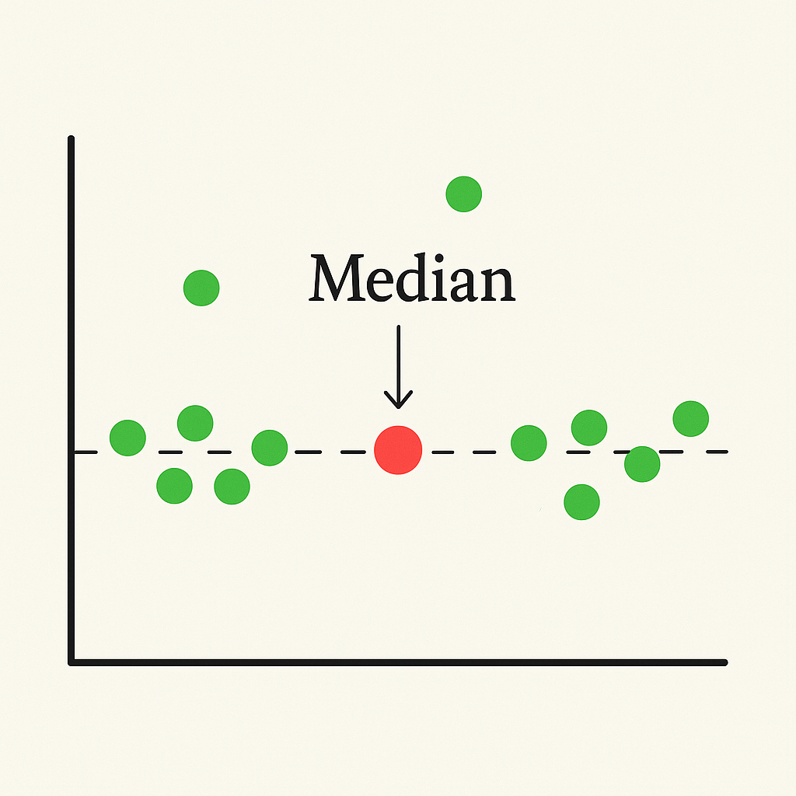
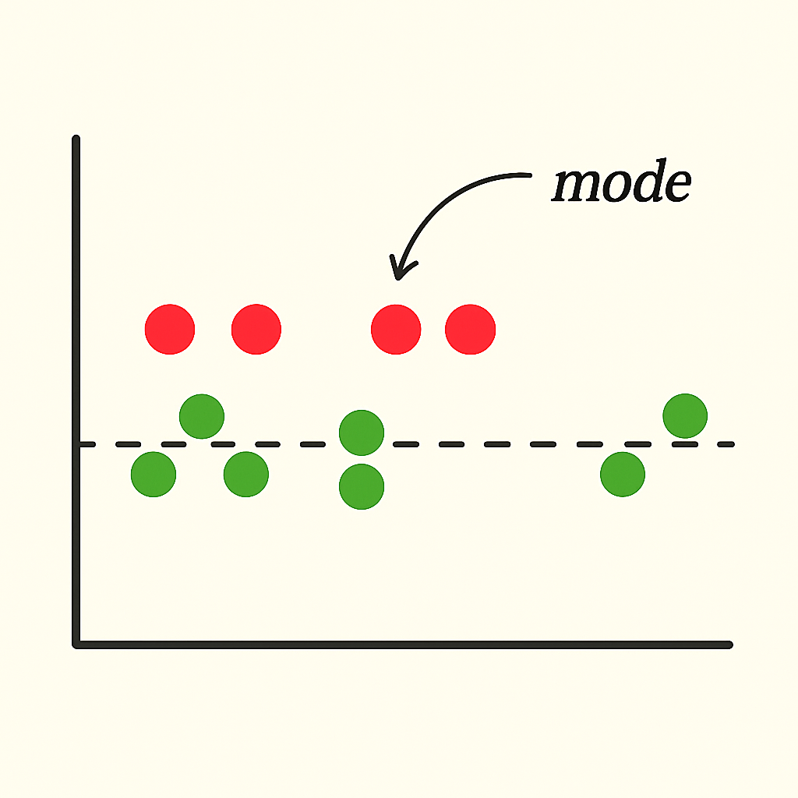

1985년, 미국 노스캐롤라이나 대학교 지리학과 졸업생의 평균 초봉은 무려 10만 달러였다. 2025년 환율 기준으로 약 1억 4천만 원에 달하는 금액이다. 어떻게 이런 수치가 나왔을까? **그 이유는 바로 NBA 전설 ‘마이클 조던’이 해당 학과 출신이었기 때문이다.**

이 사례는 우리가 흔히 사용하는 **‘평균값(Mean)’이 얼마나 쉽게 왜곡될 수 있는지를 보여주는 대표적인 예**다. 통계에서 평균은 하나의 중심값이지만, 극단적인 값(Outlier)이 끼어들면 전체 의미를 흐릴 수 있다.

엔지니어로 일하며 내가 자주 떠올리는 또 다른 기초 통계 개념은 바로 **중앙값(Median)**과 **최빈값(Mode)**이다.

## 왜곡된 평균값, 현실적인 중앙값

고등학교 때 배운 **표준편차와 Z-스코어**는 이런 왜곡을 보완해주는 도구지만, 실무에서 이들을 매번 적용하기란 번거롭다. 그럴 땐 **중앙값**이 훌륭한 대안이 된다.

예를 들어, 마이클 조던을 포함한 연봉 데이터에서 **중앙값**을 썼다면, 한 명의 아웃라이어가 전체 값을 왜곡하지 않았을 것이다. 중앙값은 정렬된 데이터의 ‘중간’에 있는 값이기에, **‘나는 전체 중 어디쯤인가?’를 판단할 때 가장 현실적인 기준점**이 된다.

## 다수가 선택한 기준, 최빈값

그렇다면 **최빈값**은 언제 유용할까? 배달 앱을 켜고 주문 내역을 살펴보자. 자주 먹는 메뉴는 어떤 기준으로 선택될까? 별점이나 리뷰보다, **반복 주문된 메뉴**가 실질적인 만족도를 보여주는 경우가 많다. 이처럼 **최빈값은 다수가 반복 선택한, 공감의 기준점**이 된다.

## 그렇다면 평균은 쓸모없을까?

물론 아니다. 평균값은 왜곡될 수 있지만, **‘전체적인 분포를 요약하고, 공정함을 설계하는 기준점’으로는 여전히 강력한 도구**다. 예를 들어 팀원에게 맨먼스(M/M)가 명확한 업무를 고르게 분배하거나, **코드 리뷰나 온콜 로테이션**처럼 반복 업무를 팀원에게 고르게 나눌 때 평균은 빠르게 기준을 제시해준다.

마지막으로 **팀 생산성을 수치로 요약**할 때, 즉 개별 성과가 아닌 전체 팀의 평균 속도를 보면 무리나 과부하를 조정하기 쉬워지기도 하므로 여전히 쓸모가 있다.

## 마무리

**기초 통계는 엔지니어의 무기다.** 엔지니어링 세계에는 완벽한 해법, **Silver Bullet**이 존재하지 않는다. 하지만 **평균값, 중앙값, 최빈값**처럼 단순한 기초 통계는 문제 해결의 방향을 제시해주는 **현실적인 도구**다.

상황에 맞는 통계 지표 하나만 잘 골라도, 머신러닝, LLM보다 빠르고 직관적인 인사이트를 얻을 수 있다.
꼭 어려운 방법만이 복잡한 문제의 해가 아닐 수 있다. 기초통계가 튼튼한 엔지니어의 판단은 간결하고 명료하다. 그게 좋은 엔지니어가 아닐까.
