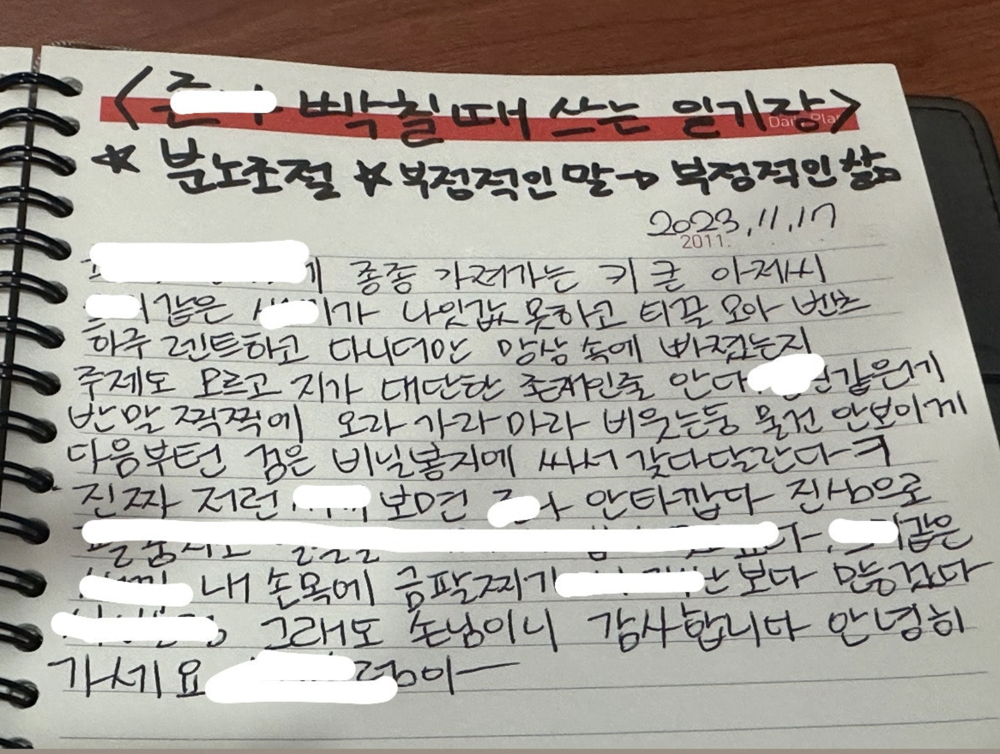

> 사람들은 상사가 느끼는 ‘감정 노동’을 과소평가하며, 대개 서비스나 의료 산업에 종사하는 사람, 예를 들어 정신과 의사나 간호사, 웨이터, 항공 승무원이 느끼는 일로 치부한다. 그러나 감정 노동은 그저 상사 역할의 일부가 아니다. 그것은 훌륭한 상사가 되기 위한 핵심이다. 
> 
> — 킴 스콧, 『실리콘밸리의 팀장들』 p.43

리더는 감정 노동의 최전선에 선 사람이다.  
하지만 이 감정 노동은 고통이 아니라 성장의 자양분일 수 있다.  
결국 어려운 사람과 함께하는 일은, 사람으로서의 성숙을 요구한다.

어느 날 멘티가 찾아와 하소연을 했다.
> '팀원이 의욕도 없고, 실력도 없고, 책임감도 없습니다. 
> 너무 힘들어요. 제가 어떻게 해야 할까요?'

그 자리에서는 곧 바로 생각나는 몇 가지 실행 지침을 조언해주었다.
- 1:1 면담으로 팀원 각각의 이야기를 따로 들어보기
- 개인적인 관심을 녹여 진심어린 피드백 시도해보기
- 비폭력 대화, Radical Candor 등 리더십 커뮤니케이션 공부해보기

하지만 집에 돌아와 가만히 내 과거를 돌아보다 문득 떠오른 해법이 있었다.  
바로 **데스노트 작성법**이다.

이 데스노트는 조직에 속하는 사람의 마음청소 도구다.  
억울한 일, 화나는 일, 분노와 원망, 감정의 쓰레기들을 그대로 적는다.  
숨기고, 포장하고, 참지 않는다. 텍스트로 분출하는 것이다.  
가감 없이.

단, 규칙이 있다.
* 반드시 **비공개**일 것. 누구에게도 들키지 말 것.
* 혼자만 아는 공간에서, 자기 자신에게만 솔직할 것.
* 그 안에서 **욕망과 증오의 목소리마저도 자유롭게** 표출할 것.

~~극한의 음지, 심연의 저 깊은 곳에서~~ 작성해야 하는 것이 핵심이다.

놀랍게도, 그렇게 몇 줄 쓰다 보면 웃기 시작한다.  
이렇게까지 화를 냈던 내가 한심하게 느껴지기도 하고,  
어느 순간엔 이유도 없이 그냥 웃긴다.

이틀, 삼일, 그렇게 며칠을 버티다 보면  
팀원을 삼진아웃시키거나, 내가 아웃되거나,  
그냥 손을 놓게 되는 순간이 온다.

일로 맺어진 인연은 결국 끝이 있다.  
그 짜증나는 사람과도, 언젠가는 안 보게 될 날이 온다.  
인연은 원래 그렇게 흘러간다.  
흘러갈 때면 그저 놓아주면 된다.

멘티를 다시 만나면 이렇게 말해주고 싶다.  
> “화가 날 때마다 데스노트를 써봐.그리고 나중에는 놔줘.그 사람도, 네 안의 부정적인 감정도.
> 다 놓을 때 쯤 되면 데스노트는 아무도 안 보는 곳에 가서 태워 (~~세절해~~)”  

<*네이버 자영업자 카페 ‘아프니까 사장이다’의 베스트 글 中*>

**[참고한 글과 책들]**  (놀랍게도 꽤나 많은 책과 글 개인적인 경험을 참고한 글이다)
- 『팀장의 탄생』 — 줄리 주오
- 『실리콘밸리의 팀장들』 - 킷 스콧
- 『소프트 스킬』 - 존 소메즈
- 예전에 읽었던 제목은 기억나지 않는 저널 테라피 관련 논문
- 네이버 자영업자 카페 ‘아프니까 사장이다’의 베스트 글들